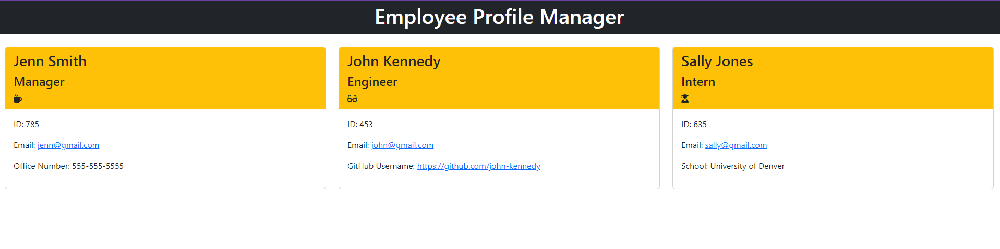

# Team-Profile-Manager

## Description

This app was created to allow the office manager of a software development team to be able to go in and generate employee profiles upon entering basic information on each employee. This way the manager can access email addresses, GitHub usernames and basic employee information all in one place. The office manager can then access the employee data easily to carry out day to day tasks.

[Team-Profile-Manager Demo Video](https://drive.google.com/file/d/1vdNj-bWNRr7W-o3zOwHID99UnpEsB6F6/view)

[GitHub Link](https://github.com/Angi-Adema/Team-Profile-Manager)

## Acceptance Criteria

GIVEN a command-line application that accepts user input
WHEN I am prompted for my team members and their information
THEN an HTML file is generated that displays a nicely formatted team roster based on user input
WHEN I click on an email address in the HTML
THEN my default email program opens and populates the TO field of the email with the address
WHEN I click on the GitHub username
THEN that GitHub profile opens in a new tab
WHEN I start the application
THEN I am prompted to enter the team manager’s name, employee ID, email address, and office number
WHEN I enter the team manager’s name, employee ID, email address, and office number
THEN I am presented with a menu with the option to add an engineer or an intern or to finish building my team
WHEN I select the engineer option
THEN I am prompted to enter the engineer’s name, ID, email, and GitHub username, and I am taken back to the menu
WHEN I select the intern option
THEN I am prompted to enter the intern’s name, ID, email, and school, and I am taken back to the menu
WHEN I decide to finish building my team
THEN I exit the application, and the HTML is generated

## Technologies

Node.js / Express.js
Jest
Inquirer
